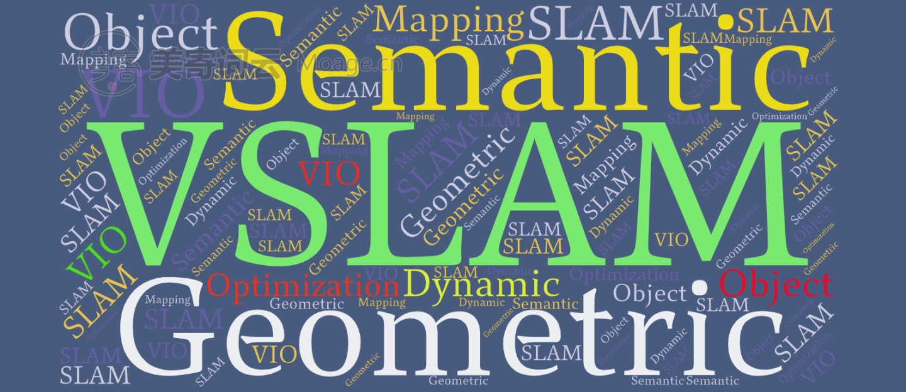

.. SLAMPark documentation master file, created by
   sphinx-quickstart on Tue May 19 23:25:56 2020.
   You can adapt this file completely to your liking, but it should at least
   contain the root `toctree` directive.

Welcome to SLAMPark's documentation!
====================================

* `Simultaneous localization and mapping (wikipedia)] <https://en.wikipedia.org/wiki/Simultaneous_localization_and_mapping/>`_

SLAM Study Notes:

* `SLAM Blog (CSDN) <https://blog.csdn.net/u011178262/article/category/7456224/>`_
* `SLAM Notes (github.io) <https://cggos.github.io/archive.html?tag=SLAM>`_
* `SLAM Notes (LaTeX on Overleaf) <https://www.overleaf.com/read/drmrxvnphrck/>`_

SLAM Basis
-------------------------

* Mathematics & Scientific Computing

  * https://github.com/cggos/sci_cmp

* Computer Vision

  * https://github.com/cggos/cgocv
  * https://cggos.github.io/archive.html?tag=ComputerVision

* Kinematics and Dynamics

* State Estimation

  * https://github.com/cggos/state_estimation_cg

* Sensors

  * Sensor Types

  * Sensor Calibration

    * https://cggos.github.io/robotics/robot-calibration.html

* ROS

  * https://github.com/cggos/ros_park

Localization & Mapping
-------------------------

* SLAM Frameworks

* SLAM Odometry

  * Visual Odometry/Visual Inertial Odometry
  * Laser Odometry
  * Wheel Odometry

* SLAM Loop Closure

  * Visual Vocabulary

* SLAM Mapping

GNSS & INS
-------------------------

* INS
* GNSS
* GIS
* Geomagnetics

Multiple Sensor Fusion
-------------------------

SLAM Benchmark
-------------------------

* SLAM Benchmark
* SLAM Dataset
* SLAM Simulation

SLAM Applications
-------------------------

* SLAM Modules
* AR (6 DoF)
* Drone (:math:`\approx` 4 DoF)
* Ground Mobile Robot (3 DoF)

SLAM QA
-------------------------

* Experience of Running SLAM
* Engineering Tricks
* Challenge

.. toctree::
   :maxdepth: 1
   :hidden:
   :caption: SLAM Basis

   slam_basis/index

.. toctree::
   :maxdepth: 1
   :hidden:
   :caption: Localization & Mapping

   slam_framworks/index
   slam_odometry/index
   slam_loopclosure/index
   slam_mapping/index

.. toctree::
   :maxdepth: 1
   :hidden:
   :caption: GNSS & INS

   slam_gnss_ins/index

.. toctree::
   :maxdepth: 1
   :hidden:
   :caption: Multiple Sensor Fusion

   slam_msf/index

.. toctree::
   :maxdepth: 1
   :hidden:
   :caption: SLAM Benchmark

   slam_benchmark/index

.. toctree::
   :maxdepth: 1
   :hidden:
   :caption: SLAM Applications

   slam_modules/index

.. toctree::
   :maxdepth: 1
   :hidden:
   :caption: SLAM QA

   slam_qa/index
