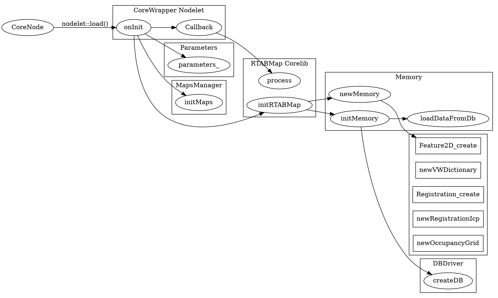
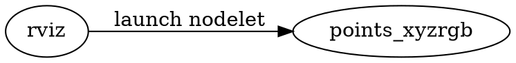

## RTAB-Map

version: 0.11.13-kinetic

[RTAB-Map](http://introlab.github.io/rtabmap/) (Real-Time Appearance-Based Mapping) is a RGB-D, Stereo and Lidar Graph-Based SLAM approach based on an incremental appearance-based loop closure detector.

* [RTAB-Map Saves the Kidnapped Robot](http://www.pirobot.org/wordpress/rtab-map-saves-the-kidnapped-robot/)

----

[TOC]

### 概述

**RTAB-Map (Real-Time Appearance-Based Mapping) is a RGB-D Graph-Based SLAM approach based on an incremental appearance-based loop closure detector.**   

The **loop closure detector** uses a bag-of-words approach to determinate how likely a new image comes from a previous location or a new location. When a loop closure hypothesis is accepted, a new constraint is added to the map’s graph, then a **graph optimizer** minimizes the errors in the map.   

A **memory management approach** is used to limit the number of locations used for loop closure detection and graph optimization, so that real-time constraints on large-scale environnements are always respected.   

RTAB-Map can be used alone with a handheld Kinect or stereo camera for 6DoF RGB-D mapping, or on a robot equipped with a laser rangefinder for 3DoF mapping.  

<center>RTAB-Map框架图</center>  


### Sensors
* Stereo Camera: Bumblebee2, ZED camera, etc.
* RGB-D Camera: Kinect, RealSense, etc.

### Front-end

### Back-end

#### Add Key-Frame to Graph

#### Loop Closure Detection

#### Graph Optimization

#### Map(2D/3D) Generation


### Demo Robot Mapping

* Command

```sh
roslaunch rtabmap_ros demo_robot_mapping.launch rtabmapviz:=false rviz:=true
```

* Node Graph


### Nodes

#### /rtabmap/rtabmap

* 流程图



#### /points_xyzrgb

* 流程图




### Code Analization

#### CameraModel

$$
FOV_{Horizontal} = \frac{W_{img}/2}{f_x}
$$

#### Problem
* Transform::interpolate
