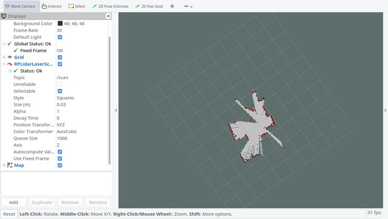

# Laser SLAM

-----

# radar

* [LiDARNews](https://lidarnews.com/)
* [在自动驾驶中，单线激光雷达能干什么?](https://www.leiphone.com/news/201612/kEUZbebrEA2WJRVE.html)

## rplidar

  

* [rplidar (ROS Wiki)](http://wiki.ros.org/rplidar)
* [RPLIDAR A1 (slamtec)](http://www.slamtec.com/en/lidar/a1)

## Laser SLAM

* [rplidar_ros](https://github.com/robopeak/rplidar_ros.git) (branch `slam`)
* [hector_slam](https://github.com/tu-darmstadt-ros-pkg/hector_slam.git)
* [openslam_gmapping](https://github.com/OpenSLAM-org/openslam_gmapping.git)
* [slam_gmapping](https://github.com/ros-perception/slam_gmapping.git)

## Run

* 运行 `roslaunch rplidar_ros view_rplidar.launch`，效果如下

  

* 通过 **hector_slam** 建图，运行 `roslaunch rplidar_ros view_slam.launch`，效果如下

  

