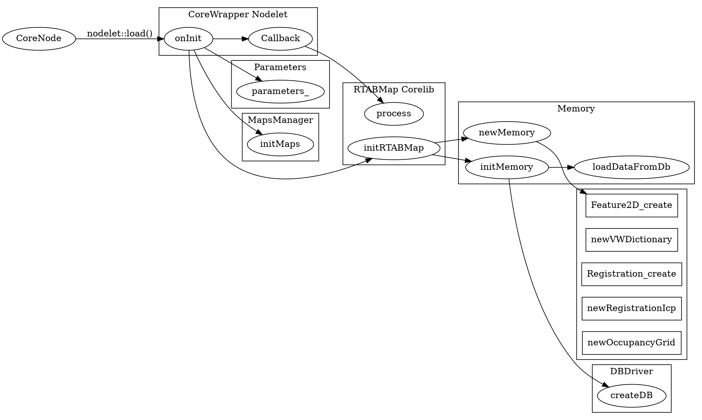
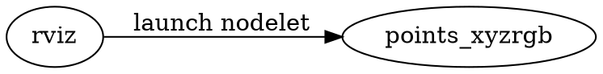

# Demo Robot Mapping

-----

[TOC]

## Introduction

* Command

```
roslaunch rtabmap_ros demo_robot_mapping.launch rtabmapviz:=false rviz:=true
```

* Node Graph


## Nodes

### /rtabmap/rtabmap

* 流程图



### /points_xyzrgb
* 流程图

